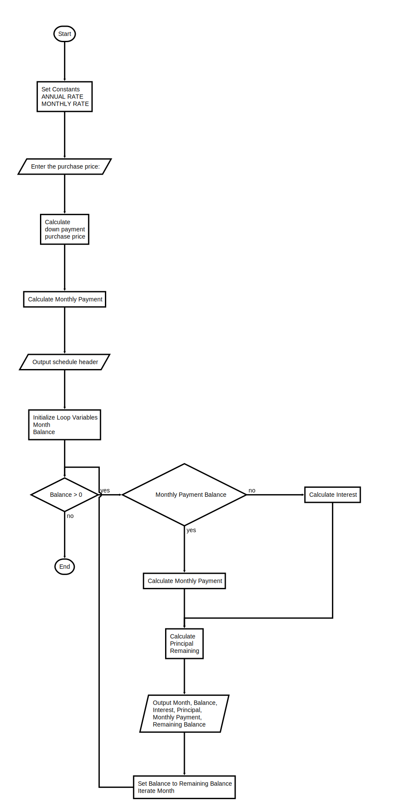

# Program: tidbit.py

## Project 3.10

Print a payment schedule for a loan to purchase a computer.

Input
   purchase price

Constants
   annual interest rate = 12%
   downpayment = 10% of purchase price
   monthly payment = 5% of purchase price

### Flowchart

---



### Starter Code

```python
"""
Program: tidbit.py
Project 1.5

Print a payment schedule for a loan to purchase a computer.

Input
   purchase price

Constants
   annual interest rate = 12%
   downpayment = 10% of purchase price
   monthly payment = 5% of purchase price
   
"""
# Set Constants


# Request input


# Calculate down payment and purchase price


# Calculate monthly payment


# Output schedule header


# Initialize loop variables

# Loop through declining balance

    # Output "Month  Starting Balance  Interest to Pay  Principal to Pay  Payment  Ending Balance" on this iteration

    # Iterate loop variables

```
