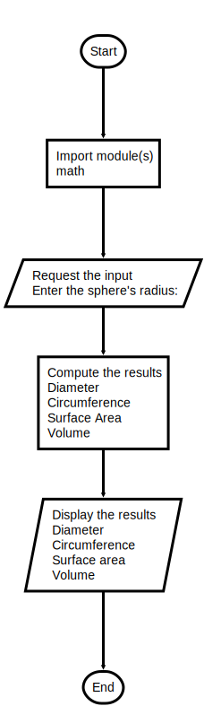

# Program: sphere.py

## Project 2.4

Write a program that takes the radius of a sphere (a floating-point number) as input and then outputs the sphere’s:

1. Diameter (2 × radius)
2. Circumference (diameter × π)
3. Surface area (4 × π × radius2)
4. Volume (4/3 × π × radius3)

For convenience, the program can import the math module.

Below is an example of the program input and output:

```bash
Radius = 5

Diameter     : 10.0
Circumference: 31.41592653589793
Surface area : 314.1592653589793
Volume       : 523.5987755982989
```

---

### Flowchart



```python
"""
Program: sphere.py
Project 2.4

Given the radius compute the diameter, circumference, and volume
of a sphere.

Useful facts:
   diameter = 2 * radius
   circumference = diameter * PI
   surface area = 4 * PI * radius * radius
   volume = 4/3 * PI * radius * radius * radius

"""
# import modules

# Request the input

# Compute the results

# Display the results

```
