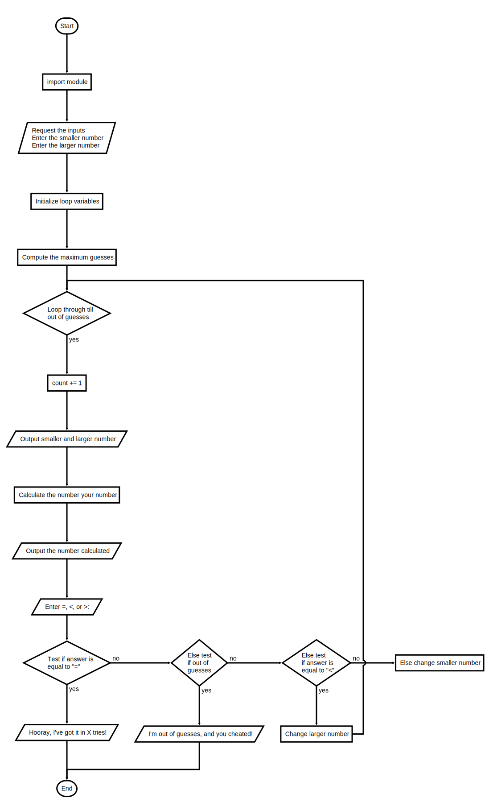

# Program: guess.py

## Project 3.3

### Instructions

Modify the guessing-game program so that the user thinks of a number that the computer must guess.

- The computer must make no more than the minimum number of guesses, and it must prevent the user from cheating by entering misleading hints.
- Use **I'm out of guesses, and you cheated** and **Hooray, I've got it in X tries** as your final output.

>(Hint: Use the math.log function to compute the minimum number of guesses needed after the lower and upper bounds are entered.)

Below are two test runs of the program:

```bash
Enter the smaller number: 0
Enter the larger number: 10

0 10
Your number is 5
Enter =, <, or >: <
0 4
Your number is 2
Enter =, <, or >: >
3 4
Your number is 3
Enter =, <, or >: =
Hooray, I've got it in 3 tries!
Enter the smaller number: 0
Enter the larger number: 50
0 50
Your number is 25
Enter =, <, or >: <
0 24
Your number is 12
Enter =, <, or >: <
0 11
Your number is 5
Enter =, <, or >: <
0 4
Your number is 2
Enter =, <, or >: <
0 1
Your number is 0
Enter =, <, or >: >
1 1
Your number is 1
Enter =, <, or >: >
I'm out of guesses, and you cheated!
```

### Flowchart

---



---

#### Starter Code

```python
"""
Program: guess.py
Project 3.3

The computer guesses the user's number using the minimum
number of attempts and prevents cheating by the user.
"""
# Import module(s)

# Request the inputs

# Compute the maximum guesses

# Initialize loop variables

# Loop through till out of guesses

    # Output smaller and larger number

    # Calculate the number your number

    # Output the number calculated

    # Input your answer

    # Test if answer is equal to "="

    # Else test if out of guesses

    # Else test if answer is equal to "<"

        # Change larger number

    # Else change smaller number

```
