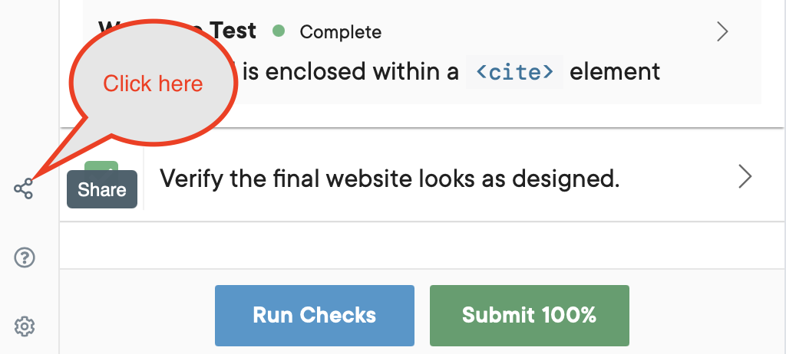
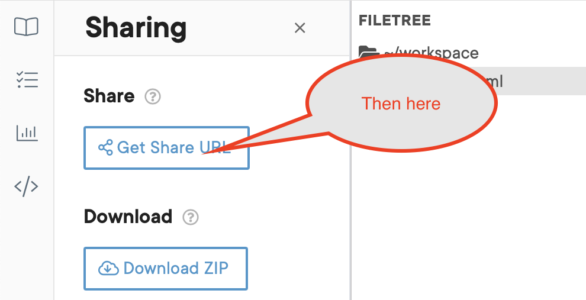
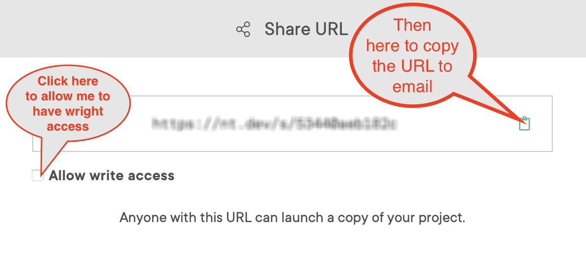

# MindTap how_to's

## Copy Share link to your code on MindTap

Below are the steps to get a copy of the link to your code. This link can shared with others to review your code.

You can email me the share URL of your code with the Share feature and I'll look over your code. See images below for steps to copy URL.

### Step1: Click on Share icon

### Step 2: Then click on Get Share URL

### Step 3: Then click on the copy icon

