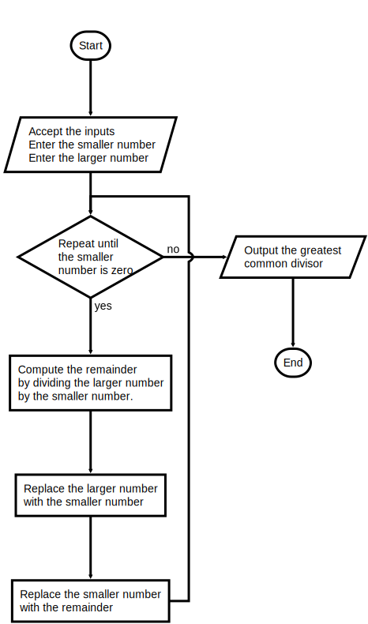

# Program: gcd.py

## Project 3.8

### Instructions

The greatest common divisor of two positive integers, A and B, is the largest number that can be evenly divided into both of them. Euclid’s algorithm can be used to find the greatest common divisor (GCD) of two positive integers. You can use this algorithm in the following manner:

1. Compute the remainder of dividing the larger number by the smaller number.
2. Replace the larger number with the smaller number and the smaller number with the remainder.
3. Repeat this process until the smaller number is zero.

The larger number at this point is the GCD of A and B. Write a program that lets the user enter two integers and then prints each step in the process of using the Euclidean algorithm to find their GCD.

An example of the program input and output is shown below:

```bash
Enter the smaller number: 5
Enter the larger number: 15

The greatest common divisor is 5
```

### Flowchart

---



---

#### Starter Code

```python
"""
Program: gcd.py
Project 3.8

Compute and print the greatest common divisor of two input
integers.
"""
# Accept the inputs

# Repeat this process until the smaller number is zero

    # Compute the remainder of dividing the larger number by the smaller number.

    # Replace the larger number with the smaller number and the smaller number with the remainder.

# Output the greatest common divisor

```
