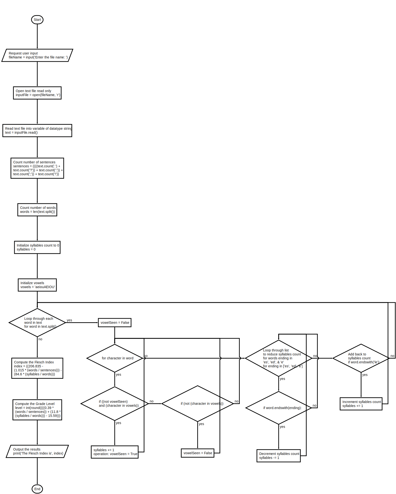

# Project 4.9

## Program: textanalysis.py

### Instructions

Computes and displays the Flesch Index and the Grade
Level Equivalent for the readability of a text file.
Updated to count syllables containing multiple vowels
as single syllables.

---

### Flowcharts

```flow
st=>start: Start
e=>end: End
op4=>input: Enter the file name
op6=>operation: Open text file read only
op8=>operation: Read text file into string variable
op10=>operation: Count number of sentences
op12=>operation: Count number of words
op14=>operation: Initialize syllables count to 0
op16=>operation: Initialize vowels 
cond19=>condition: Loop through each word in text
op121=>operation: Initialize vowelSeen = False
cond124=>condition: for each character in word
cond153=>condition: if ((not vowelSeen) and (character in vowels))
op157=>operation: syllables += 1
op159=>operation: vowelSeen = True
cond164=>operation: vowelSeen = False if  (not (character in vowels))
cond178=>condition: for ending 
cond195=>condition: syllables -= 1 if  word.endswith(ending)
cond208=>condition: syllables += 1 if  word.endswith('le')
op220=>operation: calculate Index
op222=>operation: calculate level
sub224=>subroutine: The Flesch Index is 
sub226=>subroutine: The Grade Level Equivalent is,
sub228=>subroutine: sentences,
sub230=>subroutine: words,
sub232=>subroutine: syllables,


st->op4
op4->op6
op6->op8
op8->op10
op10->op12
op12->op14
op14->op16
op16->cond19
cond19(yes)->op121
op121->cond124
cond124(yes)->cond153
cond153(yes)->op157
op157->op159
op159->cond124
cond153(no)->cond164
cond164->cond124
cond124(no)->cond178
cond178(yes)->cond195
cond195->cond178
cond178(no)->cond208
cond208->cond19
cond19(no)->op220
op220->op222
op222->sub224
sub224->sub226
sub226->sub228
sub228->sub230
sub230->sub232
sub232->e
```



---

### Starter Code

```python
"""
Program: textanalysis.py
Author: Ken
Computes and displays the Flesch Index and the Grade
Level Equivalent for the readability of a text file.
"""

# Take the inputs
fileName = input("Enter the file name: ")
inputFile = open(fileName, 'r')
text = inputFile.read()

# Count the sentences
sentences = text.count('.') + text.count('?') + \
    text.count(':') + text.count(';') + \
        text.count('!')

# Count the words
words = len(text.split())

# Count the syllables
syllables = 0
vowels = "aeiouAEIOU"
for word in text.split():
    for vowel in vowels:
        syllables += word.count(vowel)
    for ending in ['es', 'ed', 'e']:
        if word.endswith(ending):
            syllables -= 1
    if word.endswith('le'):
        syllables += 1

# Compute the Flesch Index and Grade Level
index = 206.835 - 1.015 * (words / sentences) - \
    84.6 * (syllables / words)
level = int(round(0.39 * (words / sentences) + 11.8 * 
                  (syllables / words) - 15.59))

# Output the results
print("The Flesch Index is", index)
print("The Grade Level Equivalent is", level)
print(sentences, "sentences")
print(words, "words")
print(syllables, "syllables")     

```

### Test Text

```text

```
