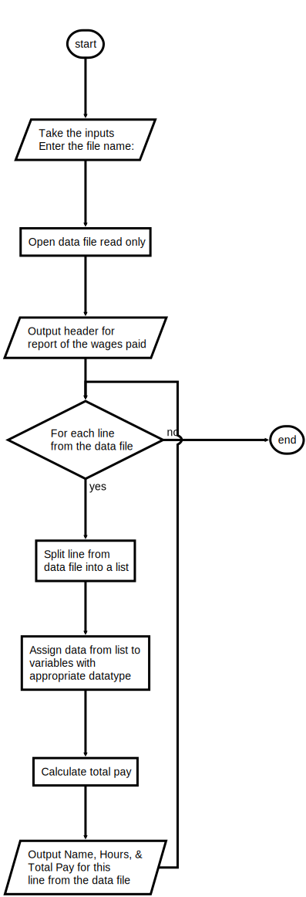

# Project 4.12

## Program: payroll.py

### Instructions

The Payroll Department keeps a list of employee information for each pay period in a text file. The format of each line of the file is the following: 
**\<last name> \<hours worked> \<hourly wage>**

Write a program that inputs a filename from the user and prints to the terminal a report of the wages paid to the employees for the given period.

- The report should be in tabular format with the appropriate header.

- Each line should contain:
  - An employee’s name
  - The hours worked
  - The wages paid for that period.

An example of the program input and output is shown below:

```text
Enter the file name: data.txt

Name            Hours      Total Pay
Lambert            34         357.00
Osborne            22         137.50
Giacometti          5         503.50
```

---

### Flowchart



---

### Starter Code

```python
"""
Program: payroll.py
Project 4.12

Print a payroll report.

Input
   A file in which each line has the form

   <last name> <hourly wage> <hours worked>

Output
   A report in tabular format.  Each line has the form

   <last name> <hours worked> <total wages>

"""

# Take the inputs


# Open the data file read only


# Read the data and print the report
# Output header for report of the wages paid

# For each line from the data file 

    # Split line from data file into a list

    # Assign data from list to variables with appropriate datatype

    # Calculate Total Pay

    # Output Name, Hours, & Total Pay for this line from the data file

```

### Data File

```text
Lambert 34 10.50
Osborne 22 6.25
Giacometti 5 100.70
```
