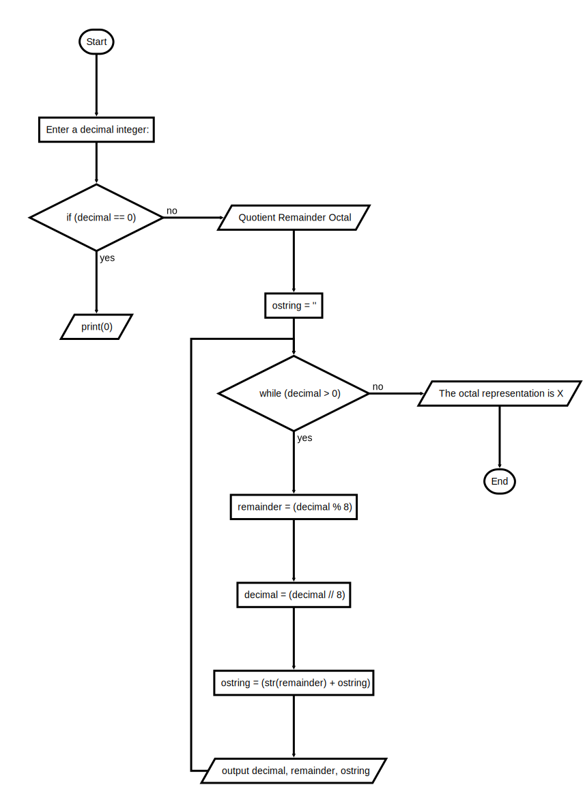
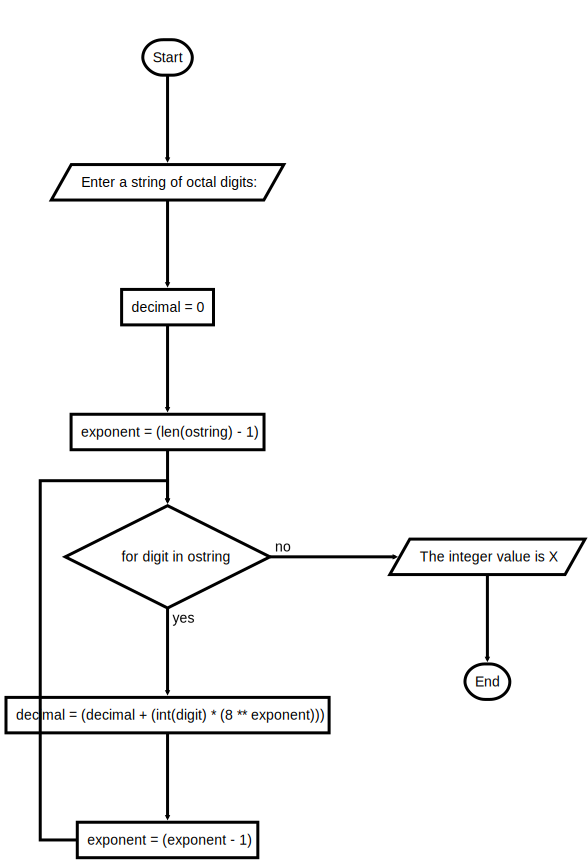

# Project 4.4

## File: decimaltooctal.py

## Instructions

Octal numbers have a base of eight and the digits 0–7. Write the scripts octalToDecimal.py and decimalToOctal.py, which convert numbers between the octal and decimal representations of integers.

These scripts use algorithms that are similar to those of the binaryToDecimal and decimalToBinary scripts developed in the Section: Strings and Number Systems.

An example of octalToDecimal.py input and output is shown below:

```text
Enter a string of octal digits: 234

The integer value is 156
```

An example of decimalToOctal.py input and output is shown below:

```text
Enter a decimal integer: 27

Quotient Remainder Octal
    3       3           3
    0       3          33
The octal representation is 33
```

### FlowChart

#### Decimal To Octal



#### Octal To Decimal



<!-- ### Starter Code

```python
"""
File: decimaltooctal.py
Project 4.4

Converts a decimal integer to a string of octal digits.
"""


```

```python
"""
File: octaltodecimal.py
Project 4.4

Converts a string of octal digits to a decimal integer.
"""

``` -->
