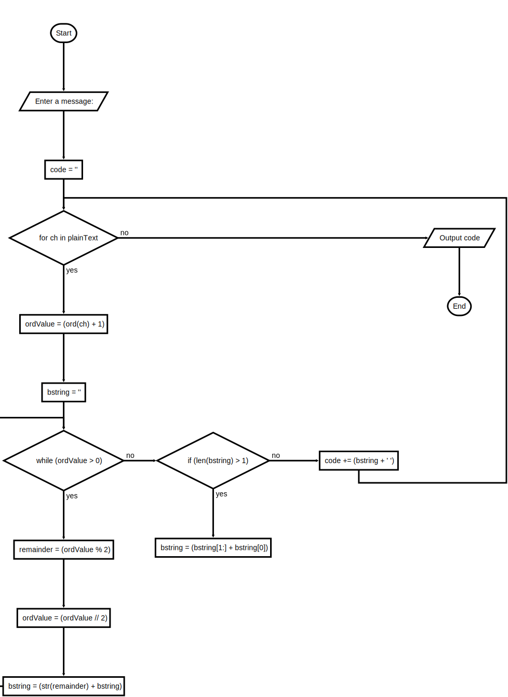

# Project 4.6

## Instructions

Use the strategy of the decimal to binary conversion implemented in Project 4, and the bit shift left operation defined in Project 5 to code a new encryption algorithm.

The algorithm should

- Add 1 to each character’s numeric ASCII value.
- Convert it to a bit string.
- Shift the bits of this string one place to the left.

A single-space character in the encrypted string separates the resulting bit strings.

An example of the program input and output is shown below:

```text
Enter a message: Hello world!

0010011 1001101 1011011 1011011 1100001 000011 1110001 1100001 1100111 1011011 1001011 000101
```

---

### Flowchart



---

### Starter Code

```python
"""
File: encrypt.py
Probject 4.6

Encypts an input string of characters and prints
the result.
"""

# Prompt user to enter a message
plainText = input("Enter a message: ")
# Initialize variable to store encrypted text
code = ""
# iterate
for ch in plainText:
    # Add 1 to ASCII value
    ordValue = ord(ch) + 1
    # Convert to binary
    bstring = ""
    while ordValue > 0:
        remainder = ordValue % 2
        ordValue = ordValue // 2
        bstring = str(remainder) + bstring
    # Shift one bit to left
    if len(bstring) > 1:
        bstring = bstring[1:] + bstring[0]
    # Add encrypted character to code string
    code += bstring + " "
print(code)
```